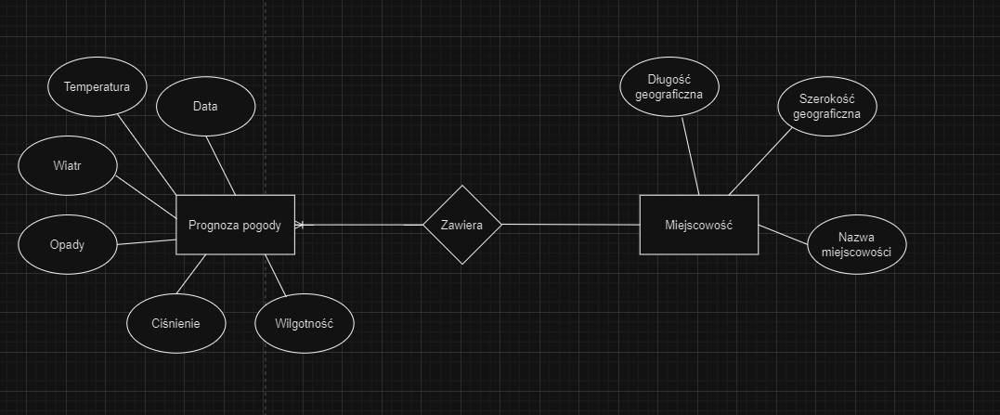

# Pogodynka — Symfony 6.3

Aplikacja pogodowa: lokalizacje i pomiary temperatury, panel do zarządzania nimi,
logowanie z rolami, API zwracające dane w JSON-ie albo CSV oraz dwie komendy konsolowe.

Projekt zaliczeniowy z przedmiotu **Aplikacje Internetowe 2**, trzeci rok informatyki
na ZUT w Szczecinie, październik–listopad 2023. Powstawał przyrostowo, laboratorium
po laboratorium — **każdy etap ma osobną gałąź** (`lab-b` … `lab-g`), a `main` odpowiada
stanowi końcowemu.

## Stack

| Warstwa | Technologie |
|---|---|
| Framework | Symfony 6.3, PHP 8.1 |
| Baza / ORM | Doctrine ORM 2.16, SQLite (domyślnie) |
| Widoki | Twig |
| Formularze i walidacja | Symfony Form, Validator z grupami walidacyjnymi |
| Bezpieczeństwo | Symfony Security — `form_login`, hierarchia ról |
| Konsola | Symfony Console |
| Testy | PHPUnit |

## Model danych

Dwie encje domenowe i użytkownik:

```
Location                          Measurement
--------                          -----------
id                                id
country   (kod kraju)             location   ManyToOne -> Location
city                              date       date
latitude   -90 … 90               celsius    decimal(3,0), -20 … 40
longitude -180 … 180
```

Temperatura jest trzymana jako `DECIMAL`, nie `float` — pomiar to wartość, którą się
porównuje i wyświetla, a nie wynik przybliżonych obliczeń.

## Co jest w środku

```
src/Entity/            Location, Measurement, User — atrybuty #[ORM\...], relacja ManyToOne
src/Repository/        repozytoria z własnymi metodami (findByLocation)
src/Form/              LocationType, MeasurementType
src/Controller/        CRUD lokalizacji i pomiarów, logowanie, widok pogody, API
src/Service/           WeatherUtil — logika wyszukiwania pomiarów, zależności w konstruktorze
src/Command/           weather:city, weather:location
config/validator/      walidacja.yaml — reguły poza encjami, z grupami create/edit
templates/             Twig: base + widoki CRUD dla obu encji, szablony JSON i CSV
tests/Entity/          MeasurementTest
```



## Warto zobaczyć

**API z negocjacją formatu** — `src/Controller/WeatherApiController.php`

```php
#[Route('/api/v1/weather', name: 'app_weather_api')]
public function index(
    WeatherUtil $util,
    #[MapQueryParameter('country')] string $country,
    #[MapQueryParameter('city')] string $city,
    #[MapQueryParameter('format')] string $format = 'json',
    #[MapQueryParameter('twig')] bool $twig = false,
): Response
```

Parametry zapytania wjeżdżają wprost do sygnatury metody przez `#[MapQueryParameter]` —
atrybut, który pojawił się dopiero w Symfony 6.3. Ten sam punkt końcowy oddaje dane
w czterech wariantach: JSON i CSV, każdy zbudowany w kodzie albo wyrenderowany Twigiem.

```
GET /api/v1/weather?country=PL&city=Szczecin
GET /api/v1/weather?country=PL&city=Szczecin&format=csv
GET /api/v1/weather?country=PL&city=Szczecin&format=csv&twig=1
```

**Walidacja poza encją, z grupami** — `config/validator/walidacja.yaml`

Reguły (szerokość −90…90, długość −180…180, temperatura −20…40) leżą w osobnym pliku
YAML i są przypisane do grup `create` i `edit`, więc formularz zakładania i formularz
edycji mogą egzekwować różne zestawy reguł bez dublowania encji.

**Hierarchia ról** — `config/packages/security.yaml`

```yaml
role_hierarchy:
    ROLE_ADMIN:
        - ROLE_USER
        - ROLE_AG_LOCATION_WRITE
        - ROLE_AG_MEASUREMENT_WRITE
```

Uprawnienia do zapisu są osobnymi rolami, a `ROLE_ADMIN` je zbiera. Dodanie roli
„edytor pomiarów" nie wymaga dotykania kontrolerów.

**Komendy konsolowe** — `src/Command/`

```bash
php bin/console weather:city PL Szczecin
php bin/console weather:location 12
```

Ta sama logika (`WeatherUtil`) obsługuje żądanie HTTP i wywołanie z terminala —
serwis nie wie, kto go woła.

## Uruchomienie

Wymagane: PHP 8.1+ i Composer.

```bash
composer install
php bin/console doctrine:schema:create     # baza SQLite w var/data.db
php -S localhost:8000 -t public            # http://localhost:8000
php bin/phpunit                            # testy
```

Domyślna konfiguracja w `.env` używa SQLite, więc nie trzeba stawiać serwera bazy.
Przejście na MySQL albo PostgreSQL to podmiana `DATABASE_URL` w `.env.local`.

## Gałęzie

| Gałąź | Co przybyło |
|---|---|
| `lab-b` | szkielet Symfony, encje, pierwsze migracje |
| `lab-c` – `lab-e` | CRUD, formularze, szablony Twig |
| `lab-f` | logowanie, role, walidacja z grupami |
| `lab-g` | API z negocjacją formatu, komendy konsolowe |
| `main` | stan końcowy (= `lab-g`) |

Gałęzie zostają celowo — pokazują, w jakiej kolejności projekt narastał.

## Co bym dziś zrobił inaczej

Kod ma trzy lata i widać to w kilku miejscach. Wypisuję je tutaj, zamiast udawać,
że ich nie ma:

- **`WeatherUtil::getWeatherForCountryAndCity` nie sprawdza, czy lokalizacja istnieje.**
  Zapytanie o nieznane miasto kończy się błędem zamiast czystym `404`.
- **W odpowiedzi CSV nagłówek `Content-Type` jest zakomentowany**, więc przeglądarka
  dostaje `text/html` z treścią CSV.
- **Testów jest jeden.** Logika w `WeatherUtil` i zachowanie API prosiły się o własne.
- Część szkieletu CRUD wyszła z `make:crud` — generator dał widoki i formularze,
  a dopisane ręcznie są serwis, walidacja, API, role i komendy.
